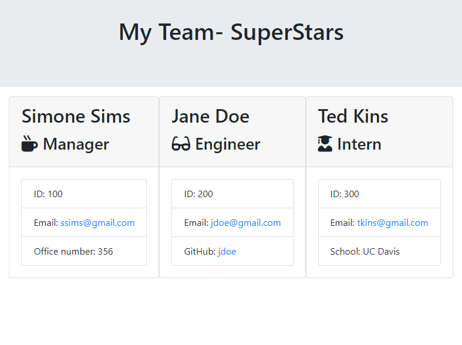

# Team Profile Generator

## Description 
This application presents your team's information in a clean and organized manner. The question based-approach will guide the user through adding managers, engineers and interns. The final html file will contain the styling and information pertaining to the team, wich includes Emplyee ID, email, office number for the manager, gitHub ID for the engineer and school association for the intern. This final html file can be found in the team folder generated in the dist folder once the process is completed. This app uses node js, inquirer and fs packets. This application is simple and easy to use, so give it a try. 

## Links 
Published site: https://mesgt.github.io/team_profile_generator/ 

## Table of Contents

* [Description](#Description) 
* [Links](#Links)
* [Installation](#Installation)
* [Usage](#Usage)
* [Credits](#Credits)
* [License](#License)
* [Badges](#Badges)

## Installation
N/A

## Usage
Open internal terminal for index.js and run "node index.js" command. Answer questions when prompted. The file can be further edited following rendering.

## Credits
N/A

## License
The Unlicense

## Badges
N/A

## Contributing

I would like to welcome you to work with me on improving this project. Feel free to contact me on gitHub or submit a pull request.

Please note that this project is released with a Contributor Code of Conduct. 
By participating in this project you agree to abide by its terms. 

If you are interested in collaborating with me on this project, please visit (https://www.contributor-covenant.org/version/2/0/code_of_conduct/) to review the latest version of Contributor Covenant. In Node.js, please run the following command "npm install -g covgen" and "covgen '<your_email_address>'". If you have npm 5.x installed you can run npx covgen <your_email_address> instead of installing globally.

## Tests

Basic testing was performed using Jest.

